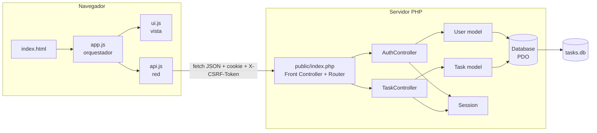
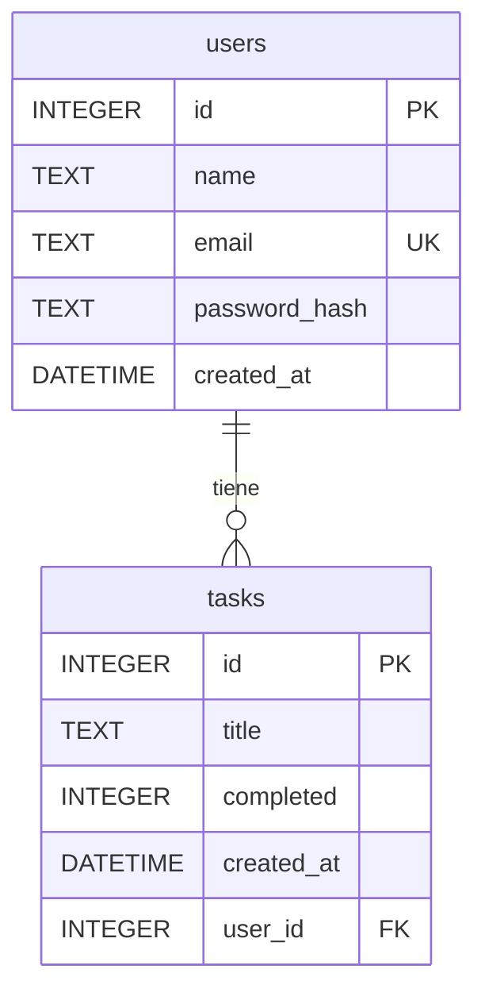
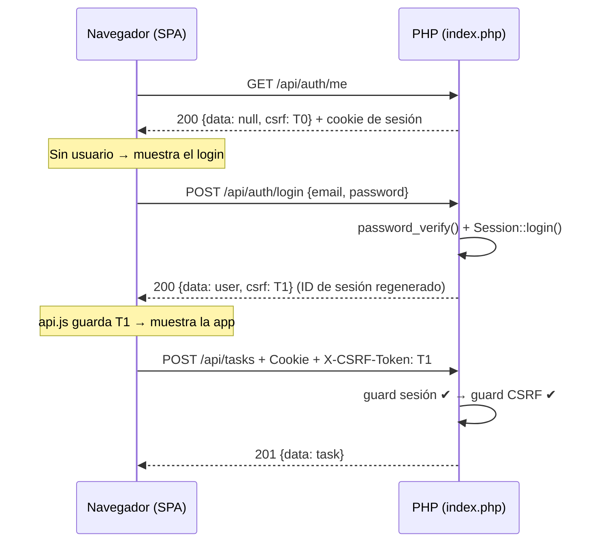
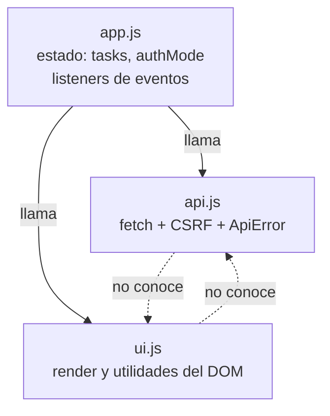
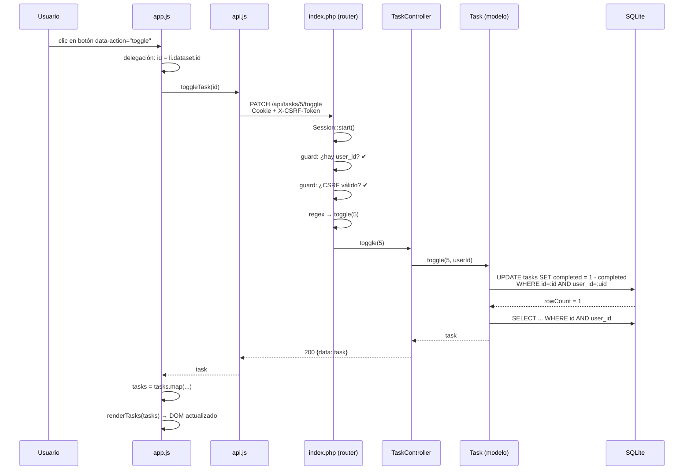

# TaskFlow: Todo App SPA con PHP + SQLite + Vanilla JS

Administrador de tareas multiusuario como **Single Page Application**. El backend es una API JSON en PHP puro (POO, MVC, PDO + SQLite) y el frontend usa JavaScript moderno con módulos ES6 y Tailwind CSS por CDN. No necesita Composer, Node ni MySQL.

Este README está pensado para **estudiar la arquitectura**: explica qué hace cada pieza, por qué está donde está y cómo viaja una petición de punta a punta.

---

## Índice

1. [Qué hace la aplicación](#1-qué-hace-la-aplicación)
2. [Stack y requisitos](#2-stack-y-requisitos)
3. [Cómo ejecutarlo](#3-cómo-ejecutarlo)
4. [Estructura de carpetas](#4-estructura-de-carpetas)
5. [Visión general de la arquitectura](#5-visión-general-de-la-arquitectura)
6. [Backend en detalle](#6-backend-en-detalle)
7. [Base de datos](#7-base-de-datos)
8. [Referencia de la API](#8-referencia-de-la-api)
9. [Autenticación, sesiones y CSRF](#9-autenticación-sesiones-y-csrf)
10. [Frontend en detalle](#10-frontend-en-detalle)
11. [Ciclo de vida de una petición](#11-ciclo-de-vida-de-una-petición)
12. [Seguridad: qué está cubierto](#12-seguridad-qué-está-cubierto)
13. [Decisiones de diseño y trade-offs](#13-decisiones-de-diseño-y-trade-offs)
14. [Limitaciones conocidas](#14-limitaciones-conocidas)
15. [Ejercicios para estudiar](#15-ejercicios-para-estudiar)
16. [Roadmap](#16-roadmap)

---

## 1. Qué hace la aplicación

- Registro e inicio de sesión de usuarios.
- Cada usuario ve, crea, completa y elimina **solo sus propias tareas**.
- Interfaz SPA: nunca se recarga la página; todo se hace con `fetch` y se repinta el DOM.
- Topbar con el nombre del usuario y botón de cerrar sesión.

---

## 2. Stack y requisitos

| Capa | Tecnología |
|---|---|
| Lenguaje backend | PHP 8.0+ (usa `match`, constructor promotion, `str_starts_with`) |
| Extensión necesaria | `pdo_sqlite` |
| Base de datos | SQLite (archivo local `database/tasks.db`) |
| Acceso a datos | PDO con sentencias preparadas |
| Frontend | JavaScript vanilla, módulos ES6 |
| Estilos | Tailwind CSS vía CDN (`cdn.tailwindcss.com`) |
| Autenticación | Sesiones PHP nativas + token CSRF |

---

## 3. Cómo ejecutarlo

```bash
cd todoList
php -S localhost:8000 -t public public
```

Abre `http://localhost:8000`, crea una cuenta y empieza a añadir tareas.

- La carpeta `database/` debe ser **escribible** por el usuario que ejecuta PHP.
- El archivo `tasks.db` y las tablas se crean solos la primera vez que se hace una petición a la API.
- Para reiniciar los datos basta con borrar `database/tasks.db`.

**Apache/Nginx:** apunta el *document root* a `public/` y redirige todo lo que no sea un archivo existente hacia `index.php`.

---

## 4. Estructura de carpetas

```
todo-app/
├── database/                     # tasks.db se genera aquí (fuera del document root)
├── src/                          # Código PHP, namespace raíz App\ (no es público)
│   ├── Core/
│   │   ├── Database.php          # Conexión PDO + migración automática
│   │   ├── Http.php              # Helpers de respuesta JSON y lectura del body
│   │   └── Session.php           # Sesión, login/logout y CSRF
│   ├── Models/
│   │   ├── User.php              # Acceso a datos de usuarios
│   │   └── Task.php              # Acceso a datos de tareas (siempre filtradas por usuario)
│   └── Controllers/
│       ├── AuthController.php    # register / login / logout / me
│       └── TaskController.php    # index / store / toggle / destroy
└── public/                       # Document root: lo único expuesto al navegador
    ├── index.php                 # Front Controller + Router + autoloader PSR-4
    ├── index.html                # Shell de la SPA (topbar, vista auth, vista app)
    └── js/
        ├── api.js                # Capa de red (fetch)
        ├── ui.js                 # Capa de vista (DOM)
        └── app.js                # Orquestador (eventos y estado)
```

**Por qué esta separación:** solo `public/` es accesible desde la web. El código PHP en `src/` y la base de datos en `database/` quedan fuera del *document root*, así que nadie puede descargarlos por URL.

---

## 5. Visión general de la arquitectura



### Capas y responsabilidades

| Capa | Archivos | Responsabilidad | Lo que NO debe hacer |
|---|---|---|---|
| **Router / Front Controller** | `public/index.php` | Recibir toda petición, decidir si es estática o API, aplicar *guards* (sesión, CSRF) y despachar al controlador | Contener lógica de negocio o SQL |
| **Controlador** | `Controllers/*` | Leer la entrada, validarla, llamar al modelo, elegir el código HTTP y responder | Escribir SQL |
| **Modelo** | `Models/*` | Todas las consultas SQL y conversión de tipos | Conocer HTTP, JSON o sesiones |
| **Core / Infraestructura** | `Core/*` | Conexión a BD, sesión, helpers HTTP | Conocer reglas del dominio |
| **Vista (cliente)** | `ui.js` + `index.html` | Pintar el DOM | Hacer peticiones de red |
| **Red (cliente)** | `api.js` | Hablar con la API, gestionar CSRF y errores | Tocar el DOM |
| **Orquestador (cliente)** | `app.js` | Estado, eventos y coordinación entre `api.js` y `ui.js` | Construir HTML a mano |

### Patrón MVC aplicado a una API

- **M**odelo: `Task`, `User`.
- **C**ontrolador: `TaskController`, `AuthController`.
- **V**ista: en una API la "vista" es la respuesta JSON (`Http::json`). La interfaz visual vive en el cliente (`ui.js`).

---

## 6. Backend en detalle

### 6.1 Autoloader PSR-4 simulado

En `public/index.php`, `spl_autoload_register` convierte el namespace en una ruta:

```
App\Controllers\TaskController  →  src/Controllers/TaskController.php
```

Regla: el prefijo `App\` equivale a la carpeta `src/`, y cada `\` es un `/`. Es lo mismo que haría Composer con `"psr-4": {"App\\": "src/"}`, pero escrito a mano para no tener dependencias.

### 6.2 Front Controller y Router (`public/index.php`)

Un único punto de entrada para todo. Su flujo:

1. **Si la ruta no empieza con `/api/`:**
   - Si es un archivo existente en `public/` (por ejemplo `js/app.js`) → `return false`, y el servidor embebido lo sirve tal cual.
   - Si no → devuelve `index.html` (comportamiento típico de SPA).
2. **Si es `/api/...`:**
   - Inicia la sesión.
   - **Guard de autenticación:** las rutas `/api/tasks*` devuelven `401` si no hay sesión.
   - **Guard CSRF:** toda petición que no sea `GET`/`HEAD` exige el header `X-CSRF-Token` válido (excepto login y registro, que aún no tienen token).
   - Despacha por `ruta + método` al controlador. Las rutas con `{id}` se resuelven con expresiones regulares.
   - Un `try/catch` global convierte cualquier excepción en `500` sin filtrar detalles internos (el detalle va a `error_log`).

### 6.3 Clases del núcleo (`Core/`)

**`Database`** (singleton estático)
- Crea la carpeta `database/` si no existe.
- Abre PDO con `ERRMODE_EXCEPTION`, `FETCH_ASSOC` y `EMULATE_PREPARES = false` (preparadas reales).
- Activa `PRAGMA foreign_keys = ON` (SQLite lo trae desactivado por defecto).
- Ejecuta `migrate()` en cada primera conexión: crea `users` y `tasks` con `CREATE TABLE IF NOT EXISTS`. También detecta bases antiguas y añade `user_id` con `ALTER TABLE`.

**`Http`**
- `json($payload, $status)`: fija el código, el header `Content-Type: application/json` y emite el JSON.
- `body()`: lee `php://input` y devuelve siempre un array (vacío si el JSON es inválido).

**`Session`**
- Configura la cookie (`HttpOnly`, `SameSite=Lax`, `Secure` si hay HTTPS) y `use_strict_mode`.
- `login()` regenera el ID de sesión (previene *session fixation*) y genera el token CSRF.
- `logout()` vacía la sesión, expira la cookie y destruye la sesión.
- `validCsrf()` compara con `hash_equals` (comparación en tiempo constante).

### 6.4 Modelos

- Reciben un `PDO` por constructor (con valor por defecto `Database::getConnection()`), lo que permite inyectar una BD en memoria en tests.
- **Todos los métodos de `Task` reciben `$userId`** y lo incluyen en el `WHERE`. Es la barrera que garantiza el aislamiento entre usuarios.
- `cast()` convierte `id` a `int` y `completed` a `bool` para que el JSON tenga tipos correctos.
- `toggle()` usa `completed = 1 - completed` en una sola sentencia: es atómico, no hay *race condition* entre leer y escribir.
- `rowCount() > 0` indica si algo cambió; así `toggle` y `delete` saben si la tarea existía (y era del usuario).

### 6.5 Controladores

- Reciben su modelo por **inyección en el constructor** con un valor por defecto (`private Task $tasks = new Task()`), una forma ligera de inyección de dependencias.
- Validan la entrada antes de llegar al modelo (título obligatorio, máximo 255; nombre, email y contraseña en el registro).
- Devuelven siempre JSON con el código HTTP adecuado.
- `TaskController::uid()` toma el ID del usuario **de la sesión del servidor**, nunca del cliente.

---

## 7. Base de datos



- `tasks.user_id` referencia `users(id)` con `ON DELETE CASCADE`: al borrar un usuario se borran sus tareas.
- `users.email` es `UNIQUE`; el controlador captura el error SQLSTATE `23000` y responde `409`.
- Índice `idx_tasks_user` sobre `tasks(user_id)` para acelerar el listado por usuario.
- `completed` es `INTEGER` (SQLite no tiene booleano); el modelo lo convierte a `bool`.

---

## 8. Referencia de la API

Todas las respuestas son `application/json; charset=utf-8`.

### Autenticación

| Método | Ruta | Cuerpo | Respuesta |
|---|---|---|---|
| `GET` | `/api/auth/me` | n/a | `200` `{data: user \| null, csrf}` |
| `POST` | `/api/auth/register` | `{name, email, password}` | `201` `{data: user, csrf}` · `400` · `409` |
| `POST` | `/api/auth/login` | `{email, password}` | `200` `{data: user, csrf}` · `401` |
| `POST` | `/api/auth/logout` | n/a | `200` `{message}` (requiere CSRF) |

### Tareas (requieren sesión)

| Método | Ruta | Cuerpo | Respuesta |
|---|---|---|---|
| `GET` | `/api/tasks` | n/a | `200` `{data: Task[]}` |
| `POST` | `/api/tasks` | `{title}` | `201` `{data: Task}` · `400` |
| `PATCH` | `/api/tasks/{id}/toggle` | n/a | `200` `{data: Task}` · `404` |
| `DELETE` | `/api/tasks/{id}` | n/a | `200` `{message}` · `404` |

### Códigos de estado usados

| Código | Cuándo |
|---|---|
| `200` | Consulta, toggle, borrado, login |
| `201` | Recurso creado (tarea, usuario) |
| `400` | Validación fallida |
| `401` | Sin sesión, o credenciales incorrectas |
| `403` | Token CSRF inválido o ausente |
| `404` | Ruta inexistente, o tarea que no existe **o no es del usuario** |
| `405` | Método no permitido en `/api/tasks` |
| `409` | Email ya registrado |
| `500` | Excepción no controlada |

### Ejemplo con `curl`

```bash
# 1. Obtener cookie de sesión y token CSRF
curl -c jar.txt http://localhost:8000/api/auth/me

# 2. Registrarse (login y registro no requieren CSRF)
curl -b jar.txt -c jar.txt -X POST http://localhost:8000/api/auth/register \
  -H 'Content-Type: application/json' \
  -d '{"name":"Ana","email":"ana@example.com","password":"secreto123"}'
# → copia el valor de "csrf" de la respuesta

# 3. Crear una tarea (requiere el header CSRF)
curl -b jar.txt -X POST http://localhost:8000/api/tasks \
  -H 'Content-Type: application/json' \
  -H 'X-CSRF-Token: <TOKEN>' \
  -d '{"title":"Estudiar la arquitectura"}'
```

---

## 9. Autenticación, sesiones y CSRF

### Flujo completo



### Por qué cada mecanismo

| Mecanismo | Problema que resuelve |
|---|---|
| Cookie `HttpOnly` | JavaScript no puede leer la cookie, así un XSS no la roba |
| Cookie `SameSite=Lax` | El navegador no envía la cookie en peticiones cruzadas mutantes, primera defensa contra CSRF |
| Token CSRF en header | Defensa adicional: un sitio externo no puede leerlo ni añadirlo |
| `session_regenerate_id(true)` | Evita *session fixation* al iniciar sesión |
| `password_hash` / `password_verify` | Contraseñas nunca en claro; sal y algoritmo gestionados por PHP |
| Mensaje genérico en login | No revela si un correo está registrado |
| Cálculo de hash cuando el usuario no existe | Iguala tiempos de respuesta (mitiga enumeración por tiempo) |
| 404 (no 403) para tareas ajenas | No revela que el recurso existe |
| Límite de 72 caracteres en la contraseña | Bcrypt trunca a 72 bytes; se rechaza para no aceptar contraseñas "recortadas" en silencio |

---

## 10. Frontend en detalle

### 10.1 Tres módulos con responsabilidad única



`api.js` y `ui.js` **no se conocen entre sí**. Solo `app.js` los coordina. Esto los hace sustituibles y fáciles de probar por separado.

### 10.2 `api.js`: capa de red

- Función única `request()` que añade `Content-Type`, `credentials: 'same-origin'` y, en métodos distintos de `GET`, el header `X-CSRF-Token`.
- Guarda en una variable de módulo el token que llega en las respuestas (`payload.csrf`).
- Lanza `ApiError` (con `status`) si la respuesta no es `ok`, de modo que `app.js` puede distinguir un `401` de otros errores.
- Exporta funciones de alto nivel: `getSession`, `login`, `register`, `logout`, `getTasks`, `createTask`, `toggleTask`, `deleteTask`.

### 10.3 `ui.js`: capa de vista

- Cachea las referencias al DOM una sola vez (`els`).
- `createTaskItem()` construye cada `<li>` con `createElement` y `textContent`. **Nunca `innerHTML`** con datos del usuario → sin XSS.
- `renderTasks()` usa `replaceChildren()`: repinta toda la lista de forma simple y actualiza el contador.
- Funciones de vista: `showAuth()`, `showApp(user)`, `setAuthMode()`, `showError()`, `setLoading()`, `toggleEmpty()`...

### 10.4 `app.js`: orquestador

- Guarda el estado (`tasks`, `authMode`) y registra los eventos.
- **`run(action)`**: envoltorio común que limpia el error, ejecuta la acción y, si falla con `401`, devuelve a la pantalla de login (sesión expirada); en otro caso muestra el error.
- **Delegación de eventos:** un solo listener en `<ul>` captura los clics de todos los botones mediante `data-action="toggle|delete"` y `closest('li').dataset.id`. Funciona aunque la lista se repinte.
- **`init()`**: pregunta `GET /api/auth/me`; si hay usuario entra a la app, si no muestra el login.

### 10.5 Dos vistas en una sola página

`index.html` contiene `#auth-view` y `#app-view`. `ui.js` alterna la clase `hidden` de Tailwind entre ambas. El topbar siempre está visible; el área de usuario (`#user-area`) solo aparece con sesión activa.

---

## 11. Ciclo de vida de una petición

Ejemplo: el usuario hace clic en el círculo de una tarea para completarla.



---

## 12. Seguridad: qué está cubierto

| Amenaza | Protección |
|---|---|
| Inyección SQL | Sentencias preparadas con parámetros nombrados y `EMULATE_PREPARES = false` |
| XSS | `textContent` en el cliente; JSON codificado con `json_encode` |
| CSRF | Cookie `SameSite=Lax` + token en header validado con `hash_equals` |
| Robo de sesión por JS | Cookie `HttpOnly` |
| Session fixation | `session_regenerate_id(true)` en el login |
| Acceso a datos ajenos (IDOR) | Todas las consultas filtran por `user_id` tomado de la sesión |
| Fuga de contraseñas | `password_hash()`; el hash nunca se envía al cliente |
| Enumeración de usuarios | Mensaje de error genérico y tiempos igualados |
| Exposición de código y BD | Fuera del *document root* |
| Fuga de errores internos | `500` genérico; el detalle se registra en el log |

---

## 13. Decisiones de diseño y trade-offs

| Decisión | Ventaja | Coste / alternativa |
|---|---|---|
| **SQLite** | Cero configuración, un solo archivo | No escala a mucha concurrencia de escritura; para producción real → MySQL/PostgreSQL |
| **Sesiones PHP** (no JWT) | Simples, revocables en el servidor, cookie `HttpOnly` | Estado en el servidor; en varios servidores necesitas almacenamiento compartido |
| **Autoloader manual** | Sin dependencias | En un proyecto real se usa Composer |
| **Router con `if/elseif` + regex** | Muy fácil de leer | No escala; el siguiente paso es una clase `Router` con tabla de rutas |
| **`Database` estática (singleton)** | Una sola conexión reutilizada | Dificulta tests; mitigado porque los modelos aceptan un `PDO` inyectado |
| **Migración en cada conexión** | Autocreación sin pasos manuales | Pequeño coste por petición; mejor con migraciones versionadas |
| **Repintado completo de la lista** | Código mínimo y sin desincronización | Con miles de tareas convendría actualizar solo los nodos cambiados |
| **Actualizar la UI tras la respuesta** | Estado siempre coherente con el servidor | Una UI optimista sería más ágil (con rollback si falla) |
| **Tailwind CDN** | Cero build | No recomendado en producción; usar la CLI con purga de CSS |
| **404 en lugar de 403** para recursos ajenos | No revela existencia | Menos explícito al depurar |

---

## 14. Limitaciones conocidas

- **Sin rate limiting** en login/registro: vulnerable a fuerza bruta en producción.
- **Sin cabeceras de seguridad** (`Content-Security-Policy`, `X-Frame-Options`, `X-Content-Type-Options`). Además, el CDN de Tailwind complica una CSP estricta.
- **Sin verificación de correo ni recuperación de contraseña.**
- **Sin tests automatizados.**
- **Tareas huérfanas:** si vienes de la versión sin usuarios, esas tareas tienen `user_id NULL` y nadie las ve. Para asignarlas: `UPDATE tasks SET user_id = 1 WHERE user_id IS NULL;`
- **Sin paginación:** `GET /api/tasks` devuelve todas las tareas del usuario.
- **Sin edición de títulos** ni filtros.
- **Servir por HTTPS en producción:** la cookie activa `Secure` solo si detecta HTTPS.

---

## 15. Ejercicios para estudiar

Ordenados de menor a mayor dificultad. Cada uno te obliga a tocar una capa distinta.

1. **Edición de título:** añade `PATCH /api/tasks/{id}` (modelo `update()`, método `update()` en el controlador, ruta en `index.php`, función en `api.js`, doble clic en `ui.js`).
2. **Filtros en el cliente:** todas / pendientes / completadas, solo en `app.js` + `ui.js`, sin tocar el backend.
3. **"Borrar completadas":** nuevo endpoint `DELETE /api/tasks/completed`. Ojo: la ruta debe evaluarse *antes* que la de `{id}`.
4. **Clase `Router`:** extrae el `if/elseif` a una clase con `get()`, `post()`, `patch()`, `delete()` y soporte de parámetros `{id}`.
5. **Clase `Request`:** encapsula método, ruta, body y headers para que los controladores no lean `php://input`.
6. **Tests con SQLite en memoria:** instancia `new Task(new PDO('sqlite::memory:'))`, ejecuta la migración y prueba que un usuario no puede ver las tareas de otro.
7. **Rate limiting:** tabla `login_attempts` (IP + fecha) y bloqueo tras N intentos fallidos.
8. **UI optimista:** actualiza el DOM antes de la respuesta y revierte el estado si la API falla.
9. **Migraciones versionadas:** carpeta `migrations/` con archivos SQL numerados y una tabla `migrations` que registre cuáles se aplicaron.
10. **Composer + PSR-4 real:** reemplaza el autoloader por `vendor/autoload.php`.

### Preguntas de autoevaluación

- ¿Por qué `toggle` usa `1 - completed` en vez de leer y luego escribir?
- ¿Qué pasaría si `Task::all()` no recibiera `$userId`?
- ¿Por qué `/api/auth/me` devuelve `200` con `data: null` en lugar de `401`?
- ¿Por qué el token CSRF se entrega en el cuerpo JSON y no en una cookie legible?
- ¿Qué ocurre si la sesión expira mientras el usuario tiene la app abierta? Sigue el flujo hasta `resetToAuth()`.
- ¿Por qué `api.js` no importa nada de `ui.js`?
- ¿Qué cambia si el servidor pasa a varias máquinas y las sesiones están en archivos locales?

---

