# TaskFlow bajo la lupa de la Unidad 4: Introducción al Diseño Arquitectónico

Guía para estudiar la estructura de la Todo App (PHP + SQLite + Vanilla JS) usando los conceptos de la **Unidad 4**: estilos arquitectónicos, aspectos de hardware y notaciones para representar arquitecturas.

La idea es poder responder tres preguntas sobre el proyecto:

1. **¿Qué estilos arquitectónicos usa** (y cuáles no)?
2. **¿Sobre qué hardware e infraestructura** se ejecuta y qué limitaciones trae?
3. **¿Cómo se representa** su arquitectura con UML, C4 y ADL?

> Complementa al `README.md` del proyecto, que explica el código archivo por archivo. Este documento se centra en el **diseño arquitectónico**.

---

## Índice

1. [Resumen del sistema](#1-resumen-del-sistema)
2. [Estilos arquitectónicos aplicados](#2-estilos-arquitectónicos-aplicados)
3. [Aspectos de hardware](#3-aspectos-de-hardware)
4. [Notación: cómo se representa la arquitectura](#4-notación-cómo-se-representa-la-arquitectura)
5. [Evaluación global](#5-evaluación-global)
6. [Preguntas de repaso](#6-preguntas-de-repaso)
7. [Ejercicios de diseño](#7-ejercicios-de-diseño)
8. [Glosario](#8-glosario)

---

## 1. Resumen del sistema

**TaskFlow** es un administrador de tareas multiusuario como Single Page Application.

| Aspecto | Detalle |
|---|---|
| Cliente | Navegador con HTML, JavaScript ES6 modular y Tailwind CSS (CDN) |
| Servidor | PHP puro con POO y MVC, expone una API JSON |
| Persistencia | SQLite (archivo `database/tasks.db`) vía PDO |
| Comunicación | HTTP + JSON, con sesión por cookie y token CSRF |
| Funcionalidad | Registro, login, y CRUD de tareas aisladas por usuario |

```
todo-app/
├── database/            # tasks.db (datos)
├── src/
│   ├── Core/            # Database, Http, Session
│   ├── Models/          # User, Task
│   └── Controllers/     # AuthController, TaskController
└── public/              # index.php (Front Controller), index.html, js/ (api, ui, app)
```

---

## 2. Estilos arquitectónicos aplicados

La guía define un estilo como un patrón de organización con **componentes, conectores y reglas de interacción**. Ningún sistema real usa un solo estilo: TaskFlow combina varios. A continuación, cada estilo de la guía evaluado contra el proyecto.

### Tabla resumen

| Estilo de la guía | ¿Se aplica? | Dónde se ve |
|---|---|---|
| **G. Cliente / Servidor** | **Sí, es el estilo dominante** | Navegador ↔ servidor PHP por HTTP |
| **B. Llamado y retorno (Capas)** | **Sí, en ambos lados** | Controlador → Modelo → BD; `app.js` → `api.js` |
| **C. Componentes independientes** | Parcialmente | Módulos `api.js`/`ui.js`, modelos con PDO inyectable |
| **A. Flujos de datos (Pipes & Filters)** | Parcialmente | Cadena de *guards* en `index.php` |
| **E. Basado en eventos** | Parcialmente (solo cliente) | Eventos del DOM y delegación de eventos |
| **D. Basado en transacciones** | Solo por el motor | Propiedades ACID de SQLite |
| **F. Peer-to-Peer** | **No** | Hay un servidor central |

---

### 2.1 Cliente / Servidor (estilo G): el estilo dominante

**Concepto de la guía:** se dividen las tareas entre un proveedor de servicios (servidor) y un solicitante (cliente). El servidor centraliza recursos y seguridad; el cliente gestiona la interfaz.

**Cómo se aplica:**

| Rol | Componente | Responsabilidad |
|---|---|---|
| **Cliente** | `index.html` + `app.js` + `api.js` + `ui.js` | Interfaz, estado de la vista, eventos del usuario |
| **Servidor** | `public/index.php` + `src/*` | Autenticación, validación, reglas de negocio, acceso a datos |
| **Conector** | HTTP + JSON | `fetch` del cliente → respuesta JSON del servidor |

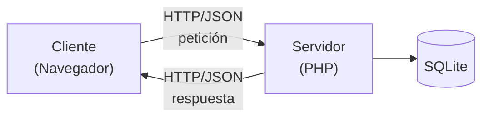

**Reglas de interacción:**
- El cliente **siempre inicia** la comunicación (petición/respuesta); el servidor nunca envía datos por su cuenta.
- El servidor **no confía en el cliente**: el ID de usuario sale de la sesión del servidor, nunca del navegador.
- Cada petición mutante lleva un token CSRF.

**Observación (cliente "grueso"):** al ser una SPA, el cliente asume más trabajo que en una web tradicional: construye el HTML, mantiene el estado (`tasks`) y gestiona el cambio entre las vistas de login y aplicación. El servidor solo ofrece datos (API), no páginas.

**Servidor con estado:** la sesión PHP guarda en el servidor quién está autenticado. Es una decisión que condiciona el escalado (ver sección 3).

---

### 2.2 Llamado y retorno / Capas (estilo B)

**Concepto de la guía:** niveles jerárquicos donde cada capa ofrece servicios a la superior y consume los de la inferior. Aísla responsabilidades (presentación, lógica de negocio, datos).

**Aplicado a TaskFlow, mapeo a la arquitectura de tres capas de la guía:**

| Capa (guía) | Equivalente en TaskFlow |
|---|---|
| **Presentación / Interfaz** | `index.html`, `ui.js`, `app.js` (cliente) |
| **Lógica de negocio** | `Controllers/*` (validación, reglas, códigos HTTP) + `Models/*` (reglas de aislamiento por usuario) |
| **Datos** | `Database.php` + SQLite |

Vista detallada de capas en el servidor:

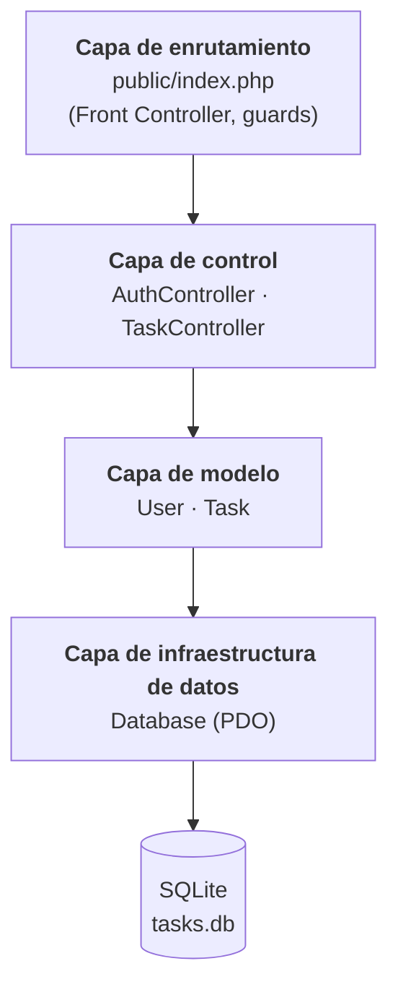

Vista detallada de capas en el cliente:

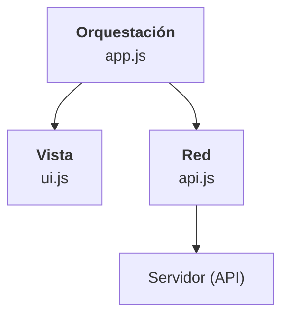

**Reglas de interacción (el "contrato" del estilo):**

| Regla | Se cumple en el proyecto |
|---|---|
| Una capa solo llama a la inmediatamente inferior | El controlador llama al modelo, nunca a PDO directamente |
| La capa inferior no conoce a la superior | `Task` no sabe nada de HTTP, JSON ni sesiones |
| El SQL vive solo en la capa de datos/modelo | Todo el SQL está en `Models/*` |
| La vista no accede a la red | `ui.js` no hace `fetch`; `api.js` no toca el DOM |

**Matiz importante (capas "relajadas"):** `Core/Http` y `Core/Session` son utilidades **transversales**: las usan tanto el router como los controladores. No son una capa más del apilamiento, sino servicios compartidos. Además, el router consulta `Session` directamente para sus *guards*. Es un uso habitual, pero estrictamente supone saltarse un nivel.

**Beneficios que se observan:**
- **Mantenibilidad:** cambiar SQLite por MySQL solo afecta a `Database.php` (y quizá a algún detalle de SQL en los modelos).
- **Testabilidad:** los modelos aceptan un `PDO` en el constructor, por lo que se pueden probar con `sqlite::memory:`.
- **Reemplazo de la interfaz:** la API JSON permitiría sustituir la SPA por una app móvil sin tocar el backend.

---

### 2.3 Componentes independientes (estilo C)

**Concepto de la guía:** componentes autónomos con dependencias directas mínimas, que se pueden reemplazar sin afectar al resto. Ejemplos: microservicios, plugins.

**Qué cumple TaskFlow:**
- `api.js` y `ui.js` **no se importan entre sí**; solo `app.js` los coordina. Se pueden sustituir o probar por separado.
- Los modelos reciben su `PDO` por constructor y los controladores reciben su modelo: **inyección de dependencias** ligera que reduce el acoplamiento.

**Qué NO es:** no es una arquitectura de microservicios ni de plugins. Es un **monolito modular**: un único despliegue, un único proceso, una sola base de datos.

| Característica | Microservicios (guía) | TaskFlow |
|---|---|---|
| Despliegue | Independiente por servicio | Único |
| Base de datos | Una por servicio | Compartida |
| Comunicación entre componentes | Red (HTTP, mensajes) | Llamadas directas a métodos |

---

### 2.4 Flujos de datos: Tuberías y Filtros (estilo A)

**Concepto de la guía:** los datos pasan secuencialmente por filtros que los transforman o validan, conectados por tuberías.

**Dónde aparece (analogía parcial):** el procesamiento de una petición en `public/index.php` se comporta como una **tubería** donde cada etapa es un filtro que puede dejar pasar la petición o cortarla:

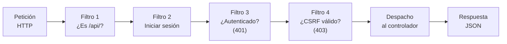

Es el mismo principio que los *middlewares* de los frameworks modernos. También se ve en la validación del registro: nombre → email → contraseña → creación, donde cada comprobación puede abortar el proceso.

**Por qué es solo parcial:** la guía se refiere a flujos continuos de datos con filtros reutilizables y procesamiento en *streaming* (como `cat | grep | sort`). Aquí los "filtros" son bloques `if` dentro de un archivo, no componentes independientes y reutilizables. Una versión más fiel sería una clase `Middleware` con una cola de filtros.

---

### 2.5 Basado en eventos (estilo E)

**Concepto de la guía:** los componentes se comunican emitiendo y recibiendo eventos, de forma asíncrona.

**Dónde aparece, solo en el cliente:**
- Los eventos del DOM (`submit`, `click`) disparan la lógica de `app.js`.
- **Delegación de eventos:** un único listener en `<ul id="task-list">` atiende los clics de todos los botones (`data-action="toggle|delete"`). Funciona aunque la lista se repinte.
- Las peticiones `fetch` son **asíncronas** (`async/await`): la interfaz no se bloquea mientras espera al servidor.

**Qué NO es:** no hay un bus de eventos ni *Pub/Sub* (como Kafka o RabbitMQ). El servidor es **síncrono** (petición → respuesta) y no emite notificaciones. Si dos pestañas del mismo usuario están abiertas, una no se entera de lo que hace la otra.

*Cómo evolucionaría:* con Server-Sent Events o WebSockets, el servidor podría publicar "tarea creada" y todos los clientes suscritos actualizarían su lista (esto sí sería el estilo basado en eventos de la guía).

---

### 2.6 Basado en transacciones (estilo D)

**Concepto de la guía:** sistemas para procesar muchas operaciones discretas con garantías **ACID** (Atomicidad, Consistencia, Aislamiento, Durabilidad). Ejemplo: banca.

**Relación con TaskFlow:** el sistema **no es transaccional por diseño** (no hay pagos ni operaciones multi-paso críticas), pero **se apoya en las garantías ACID de SQLite**:

| Propiedad | Cómo se manifiesta |
|---|---|
| **Atomicidad** | `toggle` es una sola sentencia `UPDATE ... SET completed = 1 - completed`: se aplica entera o no se aplica |
| **Consistencia** | `NOT NULL`, `UNIQUE (email)`, clave foránea `user_id` con `ON DELETE CASCADE` y `PRAGMA foreign_keys = ON` |
| **Aislamiento** | SQLite serializa las escrituras (un escritor a la vez) |
| **Durabilidad** | Los cambios confirmados quedan en el archivo `tasks.db` |

**Detalle para estudiar:** el proyecto usa sentencias individuales en modo *autocommit*. Una operación como "mover tareas a otro usuario y borrar el original" requeriría una transacción explícita (`beginTransaction()` / `commit()` / `rollBack()` de PDO).

---

### 2.7 Peer-to-Peer (estilo F): por qué NO aplica

**Concepto de la guía:** todos los nodos son a la vez cliente y servidor, sin centralización.

TaskFlow tiene roles fijos: el navegador solo es cliente y el servidor PHP solo es servidor. Los datos están **centralizados** en un único `tasks.db`. Es un buen ejemplo de contraste: en P2P no existiría un "punto único" que controle usuarios y sesiones, y la autenticación sería muy distinta.

---

## 3. Aspectos de hardware

La guía indica que el diseño debe alinearse con la infraestructura física. Análisis de TaskFlow en cada punto.

### 3.1 Distribución e infraestructura

**Escenario actual (desarrollo):** todo en una sola máquina.

```
php -S localhost:8000 -t public public/index.php
```

**Opciones de despliegue (según la guía):**

| Opción | Cómo sería para TaskFlow | Observaciones |
|---|---|---|
| **On-premise** | Servidor propio con Apache/Nginx + PHP-FPM | Control total; tú gestionas hardware y respaldos |
| **Cloud IaaS** | VM (por ejemplo, un servidor virtual con Linux) con el mismo stack | Flexible; sigues administrando el sistema operativo |
| **Cloud PaaS** | Plataforma gestionada que ejecute PHP | Menos administración; el sistema de archivos suele ser efímero, lo que **afecta a SQLite y a las sesiones en archivos** |
| **Híbrida** | API en tu infraestructura y estáticos en CDN/nube | Encaja con la separación `public/` (estáticos) y `/api` |

### 3.2 Soporte de procesamiento

- **PHP es sin estado y de proceso por petición:** cada petición es independiente (con PHP-FPM, varios procesos atienden peticiones en paralelo). No hay hilos que gestionar a mano.
- **SQLite limita la escritura concurrente:** solo un escritor a la vez. Para una Todo App personal sobra, pero con muchas escrituras simultáneas se formarían colas.
- Hashear contraseñas (`password_hash`) es **intencionalmente costoso en CPU**: en un servidor con muchos registros/logins simultáneos, este es el cálculo más pesado de la aplicación.

### 3.3 Red y latencia

| Aspecto | En TaskFlow |
|---|---|
| Cliente ↔ servidor | Cada acción del usuario es una petición HTTP; la latencia se nota directamente en la interfaz (por eso existe el indicador "Cargando…") |
| Dependencia externa | Tailwind se carga desde un CDN: sin conexión o con CDN caído, la interfaz pierde sus estilos |
| Caching | No hay caché de la API. Los archivos estáticos se benefician de la caché del navegador. Una UI optimista reduciría la latencia percibida |
| Tamaño de las respuestas | `GET /api/tasks` devuelve todas las tareas: con muchas, hace falta paginación |

### 3.4 Tolerancia a fallos y redundancia

**Estado actual: no hay redundancia.** Es un único punto de fallo (*SPOF*):

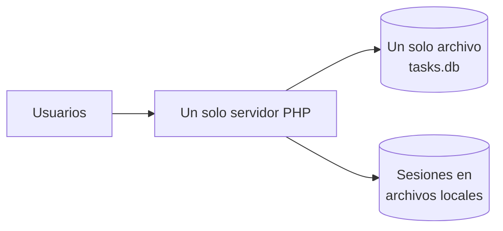

**Qué haría falta para tolerar fallos, y cómo choca con el diseño actual:**

| Mecanismo (guía) | Obstáculo en TaskFlow | Solución |
|---|---|---|
| **Balanceador de carga** con varios servidores | Las sesiones están en archivos locales: un usuario enviado a otro servidor "perdería" su sesión | Sesiones en Redis o en base de datos |
| **Replicación de datos** | SQLite es un archivo local, no un servidor con réplicas | Migrar a MySQL/PostgreSQL con réplica, o usar copias de seguridad periódicas del archivo |
| **Failover** | No hay segundo nodo | Segundo servidor en espera + BD compartida |
| **Respaldo** | Nada automático | Tarea programada que copie `tasks.db` |

> Esto ilustra un punto clave de la guía: **una decisión de software (sesiones en servidor, SQLite local) restringe las opciones de hardware**, y viceversa.

---

## 4. Notación: cómo se representa la arquitectura

La guía propone tres herramientas: **UML**, **Modelo C4** y **ADL**. Aquí se aplica cada una a TaskFlow.

### 4.1 UML: Diagrama de componentes

Muestra los módulos y sus dependencias.

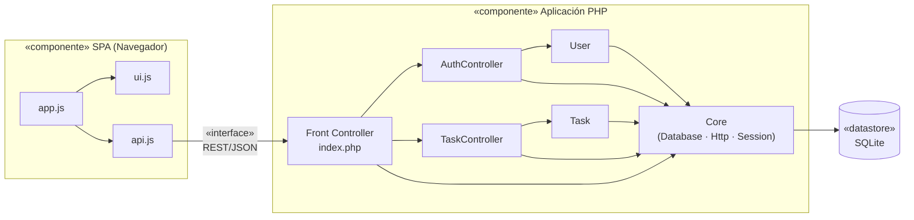

**Cómo leerlo:** las flechas indican "depende de". Observa que `ui.js` y `api.js` no dependen entre sí, y que los modelos no dependen de los controladores (dependencias en una sola dirección, sin ciclos).

### 4.2 UML: Diagrama de despliegue

Representa la topología física: nodos de hardware y el software que corre en cada uno.

**Despliegue actual (desarrollo):**

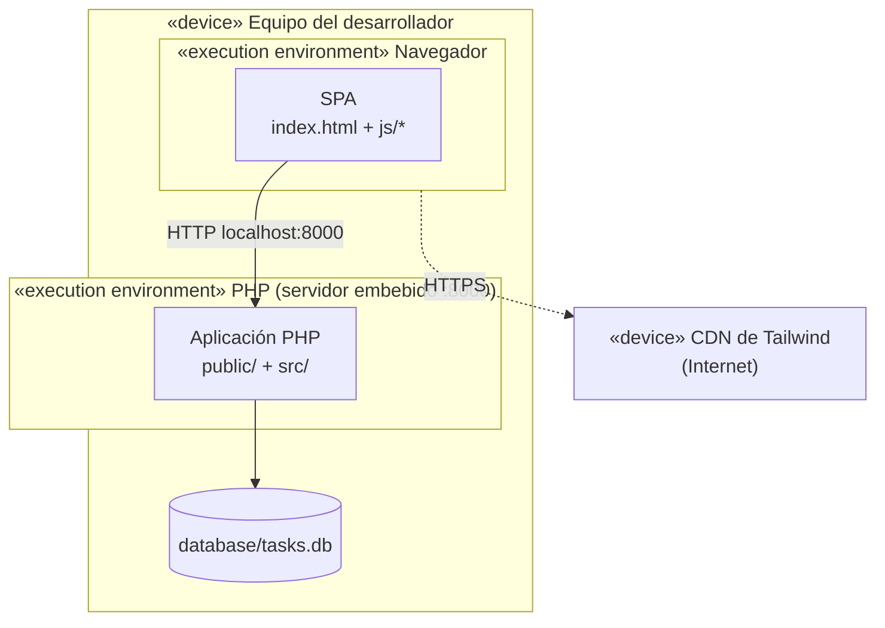

**Despliegue propuesto (producción básica):**

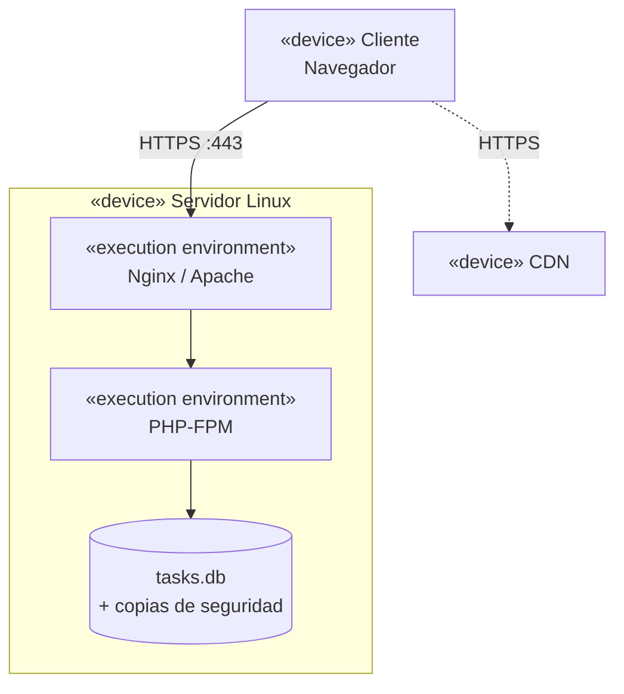

### 4.3 Modelo C4

Jerarquía de abstracción: **Context → Containers → Components → Code**. Sirve para explicar la misma arquitectura a públicos distintos.

#### Nivel 1: Contexto (para no técnicos)

*¿Quién usa el sistema y con qué se relaciona?*

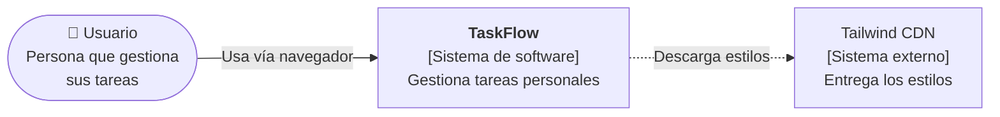

#### Nivel 2: Contenedores (para técnicos)

*Unidades ejecutables o de almacenamiento que componen el sistema.*

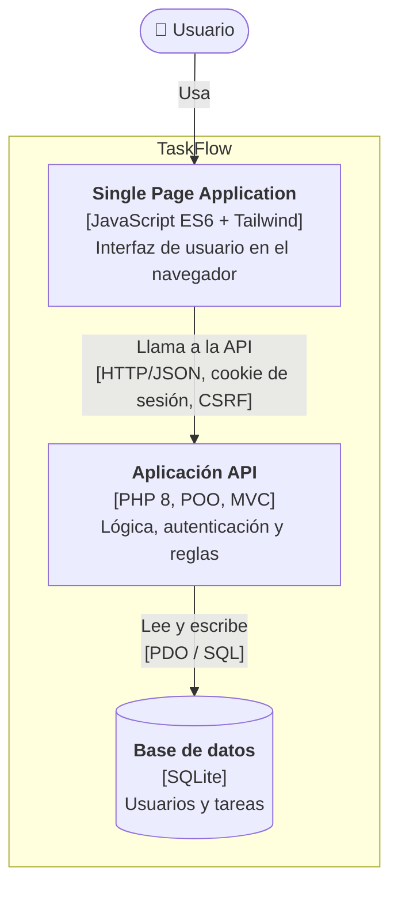

#### Nivel 3: Componentes (de la Aplicación API)

*Piezas internas de un contenedor.*

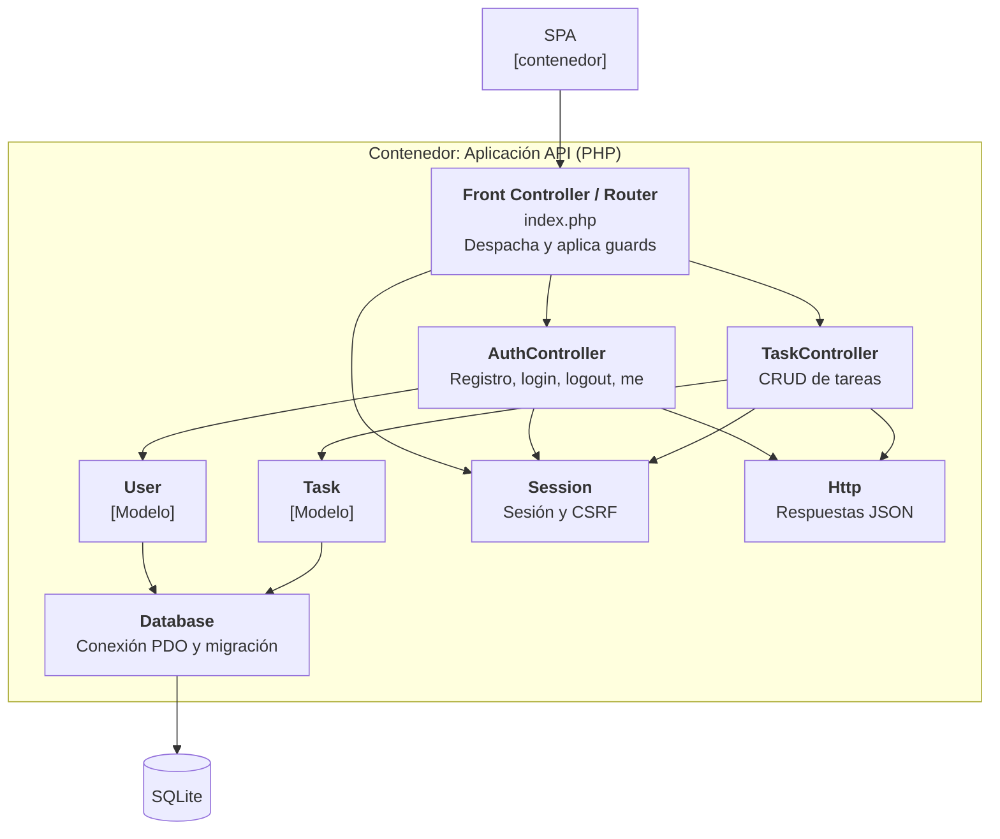

#### Nivel 4: Código (diagrama de clases)

*Detalle de las clases clave. Se usa solo para las partes que merecen explicarse.*

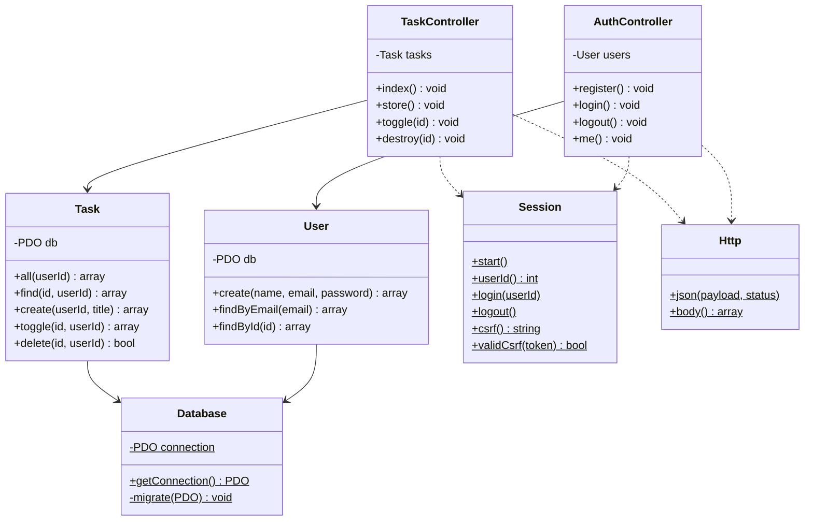

**Resumen de C4 en este proyecto:**

| Nivel | Pregunta que responde | Audiencia | Elementos |
|---|---|---|---|
| 1. Contexto | ¿Qué es y quién lo usa? | Todos, incluidos no técnicos | Usuario, TaskFlow, CDN |
| 2. Contenedores | ¿De qué piezas ejecutables se compone? | Técnicos | SPA, API PHP, SQLite |
| 3. Componentes | ¿Cómo está organizada una pieza por dentro? | Desarrolladores | Router, controladores, modelos, Core |
| 4. Código | ¿Cómo son las clases? | Desarrolladores | Diagrama de clases |

### 4.4 ADL: Lenguajes de Descripción Arquitectónica

**Concepto de la guía:** notaciones **formales** (Wright, Unicon, AADL) que permiten **analizar rigurosamente** el comportamiento del sistema, no solo dibujarlo.

**Diferencia con UML/C4:**

| UML / C4 | ADL |
|---|---|
| Orientados a comunicar visualmente | Orientados a especificar y verificar formalmente |
| Semántica flexible | Semántica precisa, analizable por herramientas |
| Uso muy extendido | Uso más académico o en sistemas críticos |

**Ejemplo ilustrativo:** TaskFlow no está descrito en ningún ADL real. Pero para entender la idea, una descripción formal de su arquitectura **al estilo de un ADL** (pseudo-notación, no es sintaxis válida de Wright ni de AADL) separaría componentes, conectores y restricciones:

```
SISTEMA TaskFlow

  COMPONENTE SPA
    puerto: solicitar        # emite peticiones
    puerto: recibir          # recibe respuestas

  COMPONENTE ServidorAPI
    puerto: atender          # recibe peticiones
    puerto: responder        # emite respuestas
    puerto: consultar        # accede a datos

  COMPONENTE BaseDatos
    puerto: ejecutar

  CONECTOR HTTP
    rol: cliente  → SPA.solicitar, SPA.recibir
    rol: servidor → ServidorAPI.atender, ServidorAPI.responder
    protocolo: cliente envía petición ANTES de que servidor responda

  CONECTOR SQL
    rol: llamador → ServidorAPI.consultar
    rol: ejecutor → BaseDatos.ejecutar

  RESTRICCIONES
    - toda petición a /api/tasks requiere sesión autenticada
    - toda petición no-GET (salvo login/registro) requiere token CSRF válido
    - ninguna consulta de tareas omite el filtro user_id
```

Lo valioso de un ADL real es que, a partir de una descripción así, una herramienta puede **comprobar propiedades** (por ejemplo, ausencia de interbloqueos en el protocolo o cumplimiento de restricciones). El apartado "restricciones" corresponde a las reglas de interacción que la guía menciona al definir un estilo.

---

## 5. Evaluación global

### Estilos combinados

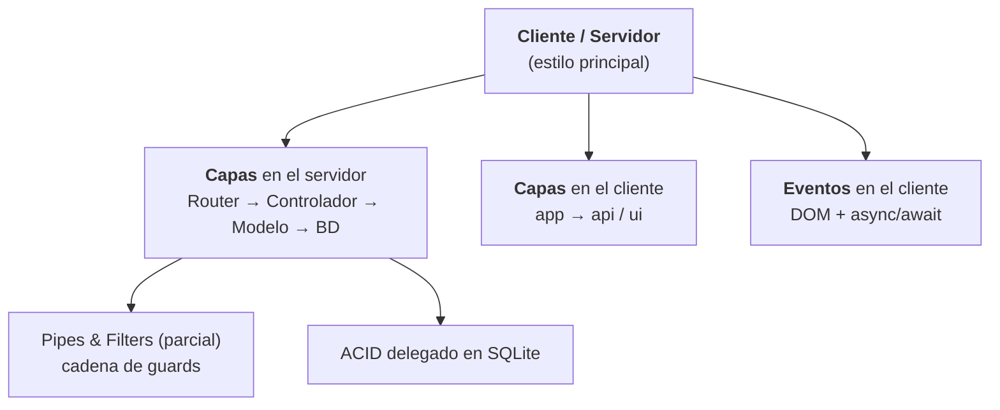

### Atributos de calidad

| Atributo | Evaluación | Justificación |
|---|---|---|
| **Mantenibilidad** | Alta | Capas con responsabilidades claras, SQL aislado en modelos |
| **Testabilidad** | Media-alta | Modelos con PDO inyectable; falta suite de tests |
| **Seguridad** | Media-alta | Sentencias preparadas, CSRF, cookie `HttpOnly`, aislamiento por usuario; faltan rate limiting y cabeceras de seguridad |
| **Escalabilidad** | Baja | SQLite local y sesiones en archivos |
| **Disponibilidad** | Baja | Punto único de fallo, sin redundancia |
| **Simplicidad / despliegue** | Muy alta | Sin dependencias ni servicios externos |
| **Interoperabilidad** | Alta | API REST/JSON reutilizable por otros clientes |

> **Conclusión:** la arquitectura es **adecuada para su propósito** (aplicación pequeña, aprendizaje, prototipo). Prioriza simplicidad y claridad sobre escalabilidad y disponibilidad, un compromiso (*trade-off*) razonable y consciente.

---

## 6. Preguntas de repaso

**Estilos**
1. ¿Cuál es el estilo arquitectónico dominante de TaskFlow y por qué?
2. Identifica las tres capas de la "arquitectura de tres capas" de la guía y los archivos que corresponden a cada una.
3. ¿Qué diferencia hay entre `Core/Session` y una capa del apilamiento? ¿Por qué se la llama "transversal"?
4. ¿Por qué la cadena de *guards* de `index.php` es una analogía de Pipes & Filters pero no una implementación completa?
5. ¿Qué parte de TaskFlow es "basada en eventos" y qué parte no? ¿Qué necesitarías para hacerlo realmente Pub/Sub?
6. ¿Por qué decimos que TaskFlow no es un sistema "basado en transacciones" aunque use una base de datos ACID?
7. ¿Por qué el estilo P2P no encaja con el requisito de "cada usuario ve solo sus tareas"?
8. ¿Es TaskFlow una arquitectura de microservicios? Justifica con la tabla comparativa.

**Hardware**
9. ¿Por qué las sesiones en archivos locales impiden poner un balanceador de carga delante de varios servidores?
10. ¿Qué limitación de SQLite afecta al soporte de procesamiento concurrente?
11. Señala dos puntos únicos de fallo del sistema y una medida de redundancia para cada uno.
12. ¿Qué ocurre con la aplicación si el CDN de Tailwind no está disponible?

**Notación**
13. ¿Qué diagrama UML usarías para mostrar que Nginx y PHP-FPM corren en el mismo servidor? ¿Y para mostrar qué clases dependen de `Database`?
14. ¿Qué nivel de C4 le mostrarías a un cliente no técnico? ¿Y a un nuevo desarrollador del equipo?
15. ¿Qué aporta un ADL que no aporta un diagrama C4?

---

## 7. Ejercicios de diseño

| # | Ejercicio | Concepto de la guía que practica |
|---|---|---|
| 1 | Dibuja el diagrama de despliegue de un escenario con **dos servidores PHP, un balanceador y MySQL** | Hardware: distribución, balanceadores, replicación |
| 2 | Diseña una clase `Middleware` y refactoriza los *guards* de `index.php` en una cadena de filtros | Pipes & Filters |
| 3 | Añade **notificaciones en tiempo real** (Server-Sent Events) para sincronizar pestañas | Basado en eventos / Pub-Sub |
| 4 | Implementa "transferir una tarea a otro usuario" con `beginTransaction()` / `commit()` / `rollBack()` | Sistemas transaccionales (ACID) |
| 5 | Mueve las sesiones a la base de datos y explica qué ventaja de hardware se gana | Tolerancia a fallos |
| 6 | Separa la **autenticación** en un servicio independiente y dibuja el nuevo nivel C2 | Componentes independientes / microservicios |
| 7 | Redacta una descripción ADL (pseudo-notación) del flujo `login → crear tarea` con sus restricciones | ADL |
| 8 | Completa un diagrama de **componentes** UML con los componentes de una futura función de "etiquetas" | UML |
| 9 | Escribe un plan de **respaldo y recuperación** para `tasks.db` | Redundancia |
| 10 | Haz un cuadro comparativo: ¿qué cambiaría en la arquitectura si fuera **P2P**? | Peer-to-Peer |

---

## 8. Glosario

| Término | Definición breve |
|---|---|
| **Estilo arquitectónico** | Patrón de organización que define componentes, conectores y reglas de interacción |
| **Componente** | Unidad de software con una responsabilidad definida |
| **Conector** | Mecanismo de comunicación entre componentes (llamada, HTTP, evento, tubería) |
| **Capa** | Nivel que ofrece servicios al superior y consume los del inferior |
| **Filtro / Tubería** | Unidad que transforma datos / canal que los transporta |
| **ACID** | Atomicidad, Consistencia, Aislamiento, Durabilidad |
| **Pub/Sub** | Patrón donde emisores publican eventos y suscriptores reaccionan |
| **P2P** | Red donde cada nodo es cliente y servidor a la vez |
| **SPA** | Aplicación de una sola página que no recarga el navegador |
| **Monolito modular** | Una sola unidad desplegable, organizada internamente en módulos |
| **SPOF** | *Single Point of Failure*: punto único de fallo |
| **Balanceador de carga** | Reparte peticiones entre varios servidores |
| **Failover** | Cambio automático a un nodo de respaldo ante un fallo |
| **IaaS / PaaS** | Infraestructura / plataforma como servicio |
| **UML** | Lenguaje Unificado de Modelado |
| **C4** | Modelo de cuatro niveles: Context, Containers, Components, Code |
| **ADL** | Lenguaje de Descripción Arquitectónica (Wright, Unicon, AADL) |
| **CSRF** | Ataque que fuerza peticiones no deseadas usando la sesión de la víctima |
| **Front Controller** | Único punto de entrada que despacha todas las peticiones |